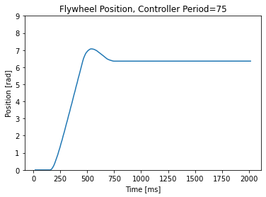
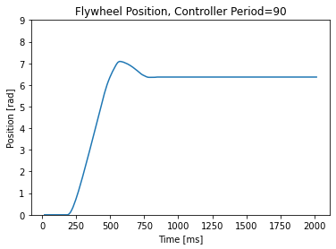
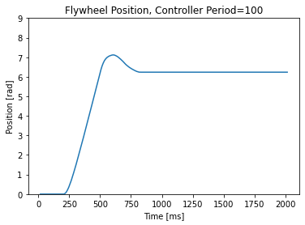
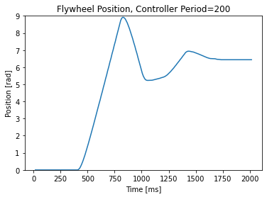

# Multitasking: On Schedule
This exercise involved utilizing our motor driver, 
encoder driver, and closed loop controller. This involved
creating seperate tasks for these, and assigning
appropriate priorities and periods (sampling rates)
for each task. This involved utilizing the files
cotask.py, task_share.py, and basic_tasks.py from
the ME405 support repository towards implementing
our multitasking regime. basic_tasks.py served
as a template towards creating our main.py in terms
of implementing the tasks and sending data over serial. 
It is necessary to perform multitasking in order to control 
the position of more than one motor. A real-time scheduler is
necessary in order to control the position of multiple motors
with their corresponding encoders and closed-loop controllers. The period
of the motor and encoder tasks were set to 10 ms, however the motor 
had a priority of 1, and the encoder had a priority of 2. The controller
period is set by the user, and the step response results are shown 
below in Figures 1-5. 

### Cotask.py
Cotask.py contains two necessary classes which are instrumental
towards task management. One class is called Task. This class 
initializes a user created task by assigning the name, 
priority, period, profile, and trace. There are several methods 
which we used in particular. The .schedule() method sees
if the task is ready to run and if so, works through the profile
and trace methods. If not, it goes to the next text
the .get_trace() method uses the trace parameter within the initialization
to determine the time and states from which the system transitions. 
The other class is called the TaskList. This task holds the list of 
tasks that is run by the task scheduler and appends these to a list
based on priority. pri_sched() runs these tasks according to priorities.

### task_share.py
This contains the classes which allow the tasks to share data so that 
it does not get corrupted due to interrupts. The central class is BaseShare
which works with queues and shares that work between tasks. The Queue class
is used to arrange a queue of data to share between tasks. The put() method puts
an item in the queue and if the queue is full, it waits until there is room
before filling the queue more. The queue is buffered. Queues are useful for sending
byte arrays. The data from the queue is processed in a First In First Out 
method (FIFO), where the oldest (first) entry is processed first. The get() method
reads the item from the queue. There is a num_in() method to check how
many items are in the queue. The Share class is more conditioned for an item
by item basis rather than a byte array. It also has the put() and get() methods
just like the Queues class. 

## Multitask Implementation Results TEST
Our results here were using the flywheel within our multitasking regime. This
shows the effect of different user defined periods for the 
motor controller on the step response. This is a test, are images working. 

*Figure 1: Step response with a controller period of 10 ms.*

The fast sampling rate yields an excellent plot with a minimal steady state error.

*Figure 2: Step response with a controller period of 75 ms.*

The larger controller period still yields decent results with small overshoot.
This is an acceptable run rate for the motor control task. It should be slightly
faster than the slowest rate. 

*Figure 3: Step response with a controller period of 90 ms.*

The overshoot becomes less continuous then smaller periods, this is less than
ideal for a run rate.

*Figure 4: Step response with a controller period of 100 ms.*

The overshoot is larger than in previous periods. This is not useful. 

*Figure 5: Step response with a controller period of 200 ms.*

There is significant overshoot, with two peaks by running the controller this slow.
This is unacceptable, and is too slow for motor control implementations. 

## Adding a second motor
This section is to be completed in the near future. We ran into difficulties within
our queues and shares when attempting to run tasks for an additional motor,
encoder, and controller. When running two motors, we expect that the tasks
will need to be run at faster periods in order to yield acceptable results. 
